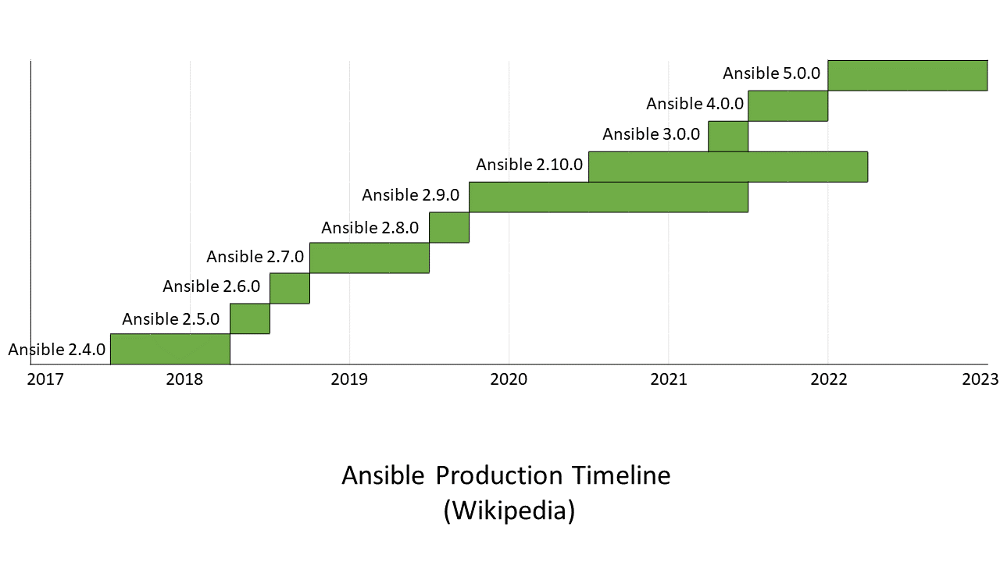

# Ansible, Automation platform

## Contenido

* [Introducción](#introducción)
* [¿Qué es Ansible?](#¿qué-es-ansible?)
    * [Historia](#historia)
    * [Definición](#ansible-plataforma-de-automatización)
* [¿Cómo Funciona?](#¿cómo-funciona?)

## Introducción

* La **automatización** es el uso de la tecnología para realizar tareas con la menor presencia humana posible.  
* Cualquier industria que conlleve tareas repetitivas puede usar la automatización, y en este caso tareas como el **aprovisionamiento**, **configuración de la red** o la **gestión de la configuración** pueden ser automatizadas.

### Aprovisionamiento

* El **aprovisionamiento** tiene que ver con el trabajo pesado, ya sea en hardware dedicado o en una nube privada, híbrida o pública. Para ejecutar sistemas empresariales, se necesita infraestructura y esa infraestructura debe estar **configurada**.
* Lo que antes se trataba de racks, cajas y cables en un centro de datos, ahora (en su mayoría) se trata de activos virtualizados, desde centros de datos definidos por software, redes y almacenamiento hasta máquinas virtuales y contenedores.

### Gestión de la configuración

* No todas las aplicaciones se crean de la misma manera. Requieren diferentes configuraciones, sistemas de archivos, puertos, usuarios... y la lista continúa. Una vez que haya automatizado el aprovisionamiento, debe poder indicar a esos recursos lo que deben hacer.
* Para ello, necesita una solución de **gestión de la configuración** sólida que permita a los desarrolladores definir simplemente la infraestructura (bare metal, virtualizada, en la nube, contenedores, etc.) de forma que todos los miembros de su equipo de TI puedan entenderla fácilmente. Cuanto más sencillo sea automatizar los scripts y las prácticas ad hoc para la gestión del sistema, más fácil será realizar el trabajo real.

## ¿Qué es Ansible?

### Historia

* El término "ansible" fue acuñado por Ursula K. Le Guin en su novela de 1966 Rocannon's World, y se refiere a los sistemas ficticios de comunicación instantánea.
* La herramienta Ansible fue desarrollada por **Michael DeHaan**, autor de la aplicación de servidor de aprovisionamiento Cobbler (servidor de aprovisionamiento de Linux que facilita y automatiza la instalación de sistemas basados en red de múltiples sistemas operativos informáticos desde un punto central utilizando servicios como DHCP, TFTP y DNS.) y coautor del marco Fedora Unified Network Controller (Func) para la administración remota.
* **Ansible, Inc.** (originalmente AnsibleWorks, Inc.) fue la empresa fundada en 2013 por DeHaan, Timothy Gerla y Saïd Ziouani para apoyar y patrocinar comercialmente a Ansible.  **Red Hat** adquirió Ansible en octubre de 2015.
* Ansible se incluye como parte de la distribución Fedora de Linux, propiedad de Red Hat, y también está disponible para Red Hat Enterprise Linux, CentOS, openSUSE, SUSE Linux Enterprise, Debian, Ubuntu, Scientific Linux y Oracle Linux a través de paquetes adicionales para Enterprise Linux, así como para otros sistemas operativos.

### Ansible, Plataforma de automatización

**Ansible** es una herramienta software de automatización de TI de código abierto que que reduce la complejidad y se ejecuta en todas partes. El uso de Ansible permite automatizar prácticamente cualquier tarea.

### Características

#### Casos de Uso
Con Ansible puedes:
* Eliminar la repetición y simplificar los flujos de trabajo
* Administrar y mantiener la configuración del sistema
* Implementar continuamente software complejo
* Realizar actualizaciones continuas sin tiempo de
inactividad

#### Princípios
* Arquitectura sin agentes
* Simplicidad
* Escalabilidad y flexibilidad
* Idempotencia y previsibilidad

## ¿Cómo funciona?

## Demo

### Instalación

En Ubuntu
